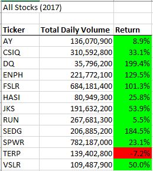
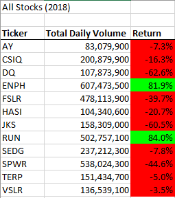

# VBA Challenge

## Overview
The purpose of this challenge was to demonstrate the usefulness of refactoring code. To demonstrate this, we made a VBA macro that analyzes data for a few stocks and our client liked it so much they want to use it for analyzing the entire stock market over a few years.  Our original code completes the intended objective, but it is very inefficient and will run too slowly for our client’s large dataset.

## Results

### Background of the dataset 

There are 12 total tickers and 3k+ lines in this Excel file.

### Original code
In the original code we loop over the entire file but only collect the relevant information of one ticker at a time.  This gets the job done but will be too inefficient to be used on larger datasets with many tickers.

     For i = 0 To 11
       ticker = tickers(i)
       totalVolume = 0
       Worksheets(yearValue).Activate
       For j = 2 To RowCount
           If Cells(j, 1).Value = ticker Then
               totalVolume = totalVolume + Cells(j, 8).Value
           End If
           If Cells(j - 1, 1).Value <> ticker And Cells(j, 1).Value = ticker Then
               startingPrice = Cells(j, 6).Value
           End If
           If Cells(j + 1, 1).Value <> ticker And Cells(j, 1).Value = ticker Then
               endingPrice = Cells(j, 6).Value
           End If
       Next j
       Worksheets("All Stocks Analysis").Activate
       Cells(4 + i, 1).Value = ticker
       Cells(4 + i, 2).Value = totalVolume
       Cells(4 + i, 3).Value = endingPrice
    Next i

### Refactored code
After reviewing the code, we decided to change the structure of our main for loop.  Instead of only collecting the relevant information on one ticker for each pass through the file we collect all the info we need in only one pass.  This means that our new code only has to loop through the file once while the original would have to repeat the same loop for each ticker.

    For i = 2 To RowCount
        ticker = tickers(tickerIndex)
        tickerVolumes(tickerIndex) = tickerVolumes(tickerIndex) + Cells(i, 8).Value
        
        If Cells(i - 1, 1).Value <> ticker And Cells(i, 1).Value = ticker Then
            tickerStartingPrices(tickerIndex) = tickerStartingPrices(tickerIndex) + Cells(i, 6).Value
        End If
        
        If Cells(i + 1, 1).Value <> ticker And Cells(i, 1).Value = ticker Then
            tickerEndingPrices(tickerIndex) = tickerEndingPrices(tickerIndex) + Cells(i, 6).Value
            tickerIndex = tickerIndex + 1
        End If
    Next i
    For i = 0 To 11
        Worksheets("All Stocks Analysis").Activate
        ticker = tickers(i)
        Cells(i + 4, 1).Value = ticker
        Cells(i + 4, 2).Value = tickerVolumes(i)
        Cells(i + 4, 3).Value = tickerEndingPrices(i) / tickerStartingPrices(i) - 1
    Next i

### Stock Analysis
Our client was very impressed by the macro which boiled down a large data set into an understandable format.  Using the macro, we could easily compare the performance of these tickers over 2017 and 2018.

 

The output of the macro allowed our client to easily see the great gains that were made in 2017 and the large losses which occurred in 2018.

## Summary

Refactoring code is a critical component of programming.  It can allow you to increase the performance of your code, improve readability, and simplify your code by consolidating repetitive sections into one. That being said there are some disadvantages to refactoring.  For example, there is often diminishing returns of benefit to refactoring.    Additionally, refactoring code carries risk of introducing new bugs. And chiefly refactoring code takes time. Oftentimes you just need to get the project done even if it isn’t the best performing or most elegant solution. 

Our original code completed the objective our client asked for but the problems in its inefficient design would compound over larger datasets.  The refactored code was much faster and was also arguably easier to understand.  This is a great example of the importance of refactoring code without going overboard.  If we were to refactor this code again, we would not be able to get the enormous boost in performance we saw the first time.

